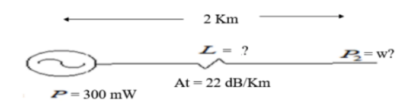

| Un cable UTP Cat 6 presenta una atenuación típica de 22 dB/Km. para señales de 10 Mhz. Suponiendo que la señal transmitida tiene una potencia de 300 mW, calcular la potencia recibida en W, después de haber recorrido 2 Km. |
| ----------------------------------------------------------------------------------------------------------------------------------------------------------------------------------------------------------------------------- |

---

$ -22 dB/km,$ en 2 km son $ -44 dB $

convierto de $ mW a W $;

$$
 300 mW = 0,3 W
$$

entonces:

$$
- 44 dB = 10 * log_{10}(\frac{P_2}{0,3 W})
$$

$$
P_2 = 10^{4,4} * 0,3
$$

$$
P_2 = 1,19 * 10^{-5}
$$

> La potencia recibida después de recorrer 2 km, es de:

$$
1, 19 * 10 −5 W
$$
