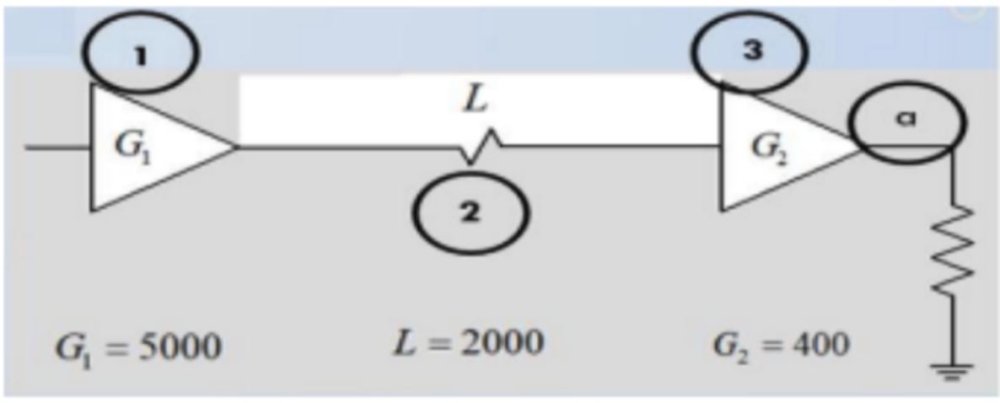
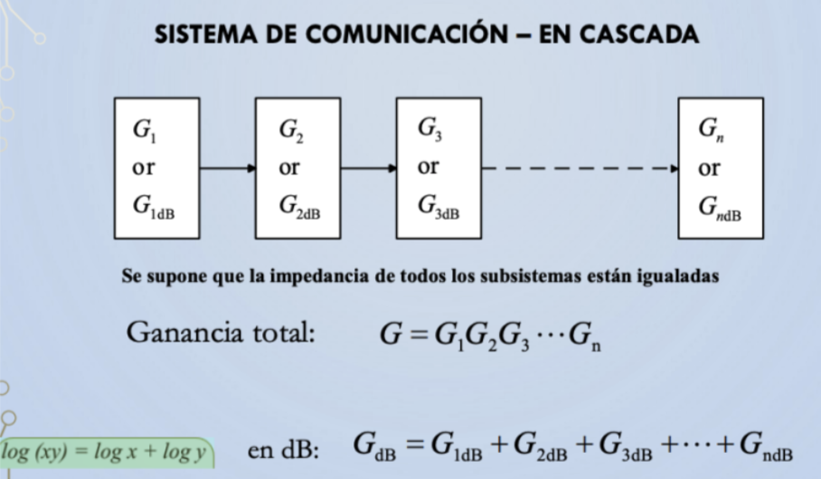

| Para el sistema de comunicación de la figura determine:     |
| ----------------------------------------------------------- |
| a) Ganancia absoluta de todo el enlace (punto a)            |
| b) Ganancia en el punto (a) en dB.                          |
| c) Ganancia o Atenuación en dB, para cada tramo del enlace. |

---

Repaso teórico:

a)

$$
G_a = G_1 * G_2 * G_3
$$

$$
G_a = 5000 * \frac{1}{2000} * 400
$$

$$
G_a = 1000
$$

> Potencia absoluta en a: 1000

b)

$$
G_{db} = 10 * log_{10} * (1000W)
$$

$$
G_{db} = 30 dB
$$

> Potencia en dB en a: 30 dB

c)

Tramo 1

$$
G_{dB} = 10. log_{10}(5000 W) = 36, 989 dB
$$

Tramo 2

$$
G_{dB} = 10. log_{10}(2000 W) = 33, 010 dB
$$

Tramo 3

$$
G_{dB} = 10. log_{10}(400 W) = 26, 020 dB
$$

(#) Podemos hacer la suma de los decibelios (37 dB - 33 dB + 26 dB = 30 dB) que coincide con el valor calculado en el punto b.
