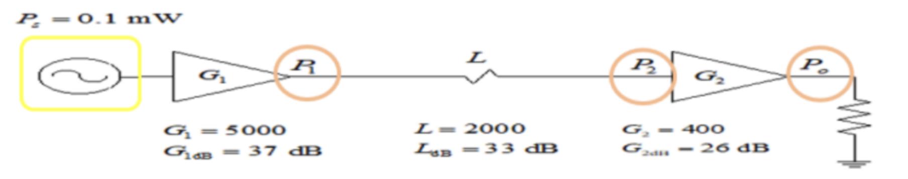

| Una fuente sinusoidal se encuentra conectada al sistema del ejemplo anterior. |
| ----------------------------------------------------------------------------- |
| a) niveles de potencia en watts en todas las uniones.                         |
| b) niveles de potencia en dBm en todas las uniones.                           |

---

Podemos hacer los cálculos usando las propiedades de los circuitos en cascada

Cálculo $ P_1 $:

$$
P_1 = G_1 * P_s = 5000 * 0,1 mW = 500 mW = 0,5 W
$$

$$
P_1 = 0,5 W
$$

Cálculo $ P_2 $:

$$
P_2 = \frac{P_1}{L} = \frac{500 mW}{2000} = 0,25 mW = 0,00025 W = 0, 25*10^{-3} W = 2,5*10^{−4} W
$$

$$
P_2 = 2,5*10^{−4} W
$$

Cálculo $ P_0 $:

$$
P_0 = P_2 * G_2 = 0,25 mW * 400 = 100 mW = 0,1 W
$$

$$
P_0 = 0,1 W
$$

> La potencia en $P_1$ es $0,5 W$.

> La potencia en $P_2$ es $ 2,5 . 10^{−4} W $

> La potencia en $P_0$ es $0,1 W$.

Ahora sabemos las potencias $ P_0, P_1, P_2 $, por lo que podemos pasar a dBm.

Cálculo $ P_1 (dBm) $:

$$
P_1 (dBm) = 10 * log_{10}(\frac{500 mW}{1 mW}) = 27 dBm
$$

$$
P_1 (dBm) = 27 dBm
$$

Cálculo $ P_2 (dBm) $:

$$
P_2 (dBm) = 10 * log_{10}(\frac{0,25 mW}{1 mW}) = -6 dBm
$$

$$
P_2 (dBm) = -6 dBm
$$

Cálculo $ P_0 (dBm) $:

$$
P_0 (dBm) = 10 * log_{10}(\frac{100 mW}{1 mW}) = 20 dBm
$$

$$
P_0 (dBm) = 20 dBm
$$

Cálculo $ P_s (dBm) $:

$$
P_s (dBm) = 10 * log_{10}(\frac{0,1 mW}{1 mW}) = -10 dBm
$$

$$
P_s (dBm) = -10 dBm
$$

> La potencia en $P_1$ es $ 27 dBm$.

> La potencia en $P_2$ es $-6 dBm$.

> La potencia en $P_0$ es $ 20 dBm$.

---

Pero también se puede hacer usando la fórmula clásica:

Para $ P_s $ tenemos el dato $ P_s = 0, 1 mW $, entonces usamos la fórmula

$$
 P_{s(dBm)} = 10 * log_{10}(\frac{0,1 mW}{1 mW}) = - 10 dBm
$$

lo cual coincide con lo calculado anteriormente. Y ahora podemos sumar:

$$
P_1 = − 10dBm + 37 dB = 27 dBm
$$

( dBm ± dB = dBm )

> $ P_1 = 27 dBm $ (coincide)

$$
 P_2 = 27 dBm − 33 dB = − 6 dBm
$$

> $ P_2 = − 6 dBm $ (coincide)

$$
 P_0 = − 6 dBm + 26 dB = 20 dBm ( dBm ± dB = dBm )
$$

> $ P_0 = 20 dBm $ (coincide)
