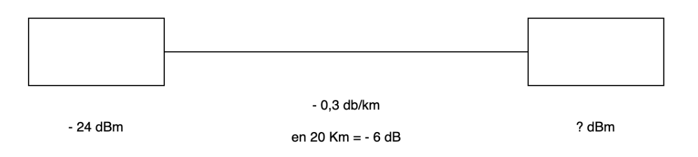

| En un enlace óptico se utiliza una fibra monomodo con una atenuación de 0,30 dB/Km. Si el enlace tiene una longitud de 20000 m. y el transmisor tiene una potencia = - 24 dBm. |
| ------------------------------------------------------------------------------------------------------------------------------------------------------------------------------ |
| a) ¿Cuál será la potencia al final del enlace expresada en mW?                                                                                                                 |
| b) ¿Cuál será la potencia del transmisor expresada en mW?                                                                                                                      |

$$
 24\ dBm −6\ dB = −30 dBm
$$

$$
 -30\ dBm = 10 * log_{10}(\frac{P_{final}}{1\ mW})
$$

$$
P_{final} = 10^{\frac{-30}{10}}\ mW
$$

> a) La potencia final es $ 0,001 mW $

$$
 -24\ dBm = 10 * log_{10}(\frac{P_{transmisor}}{1\ mW})
$$

$$
P_{transmisor} = 10^{\frac{-24}{10}}\ mW
$$

> a) La potencia del transmisor es $ 0,004 mW $
