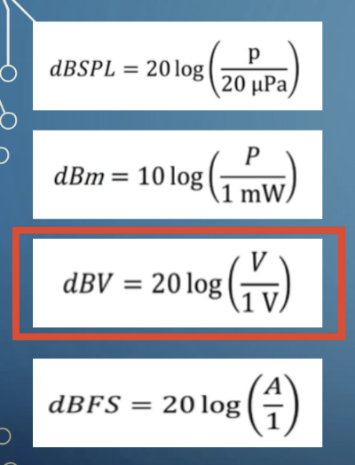

| En una línea de transmisión alámbrica la amplitud de la señal es de 20 dBv y la amplitud del ruido presente en la línea es de 5 mV. Determine: La relación (señal/ruido) expresada en dB |
| ---------------------------------------------------------------------------------------------------------------------------------------------------------------------------------------- |

$$
 P_{señal} = 20 dBV
$$

$$
 P_{ruido} =  5\ mV = 0,005\ V
$$

$$
P_{señal_{dBV}} = 20 * log_{10}(\frac{P_{señal\ V}}{1 V})
$$

$$
20\ dBV= 20 * log_{10}(\frac{P_{señal\ V}}{1 V})
$$

$$
P_{señal_{dBV}} = 10\ V
$$

ahora pasamos de $V$ a $dB$

$$
(S/N)_{dB} = 10 * log_{10}(\frac{10\ V}{0,005\ V})
$$

$$
(S/N)_{dB} = 66\ dB
$$

> La relación S/R es de $66\ dB$.
