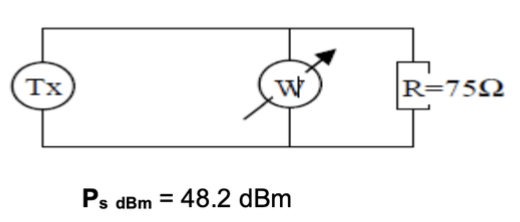

| Se conecta un transmisor a una resistencia de 75 Ω. Luego se conecta un wattimetro (instrumento de lectura de potencia) al circuito y se obtiene una lectura de potencia de 67 W. |
| --------------------------------------------------------------------------------------------------------------------------------------------------------------------------------- |
| a) ¿Cuál es la potencia expresada en dBm que llega a la resistencia?                                                                                                              |
| b) Grafique un esquema referido al planteamiento del problema.                                                                                                                    |

Para pasar la potencia de 67 W a dBm, primero hay que pasar W a mW.

$$
67\ W = 67 * 10^{3}\ mW = 6,7 * 10^{4}\ mW
$$

Ahora llevamos de $mW$ a $dBm$:

$$
P_{dBm} = 10 * log_{10}(\frac{ 6,7 * 10^{4}\ mW}{1\ mW})
$$

$$
P_{dBm} = 48,26\ dBm
$$

> La potencia expresada en dBm que llega a la resistencia es $48,26\ dBm$.

> b) Gráfico:

