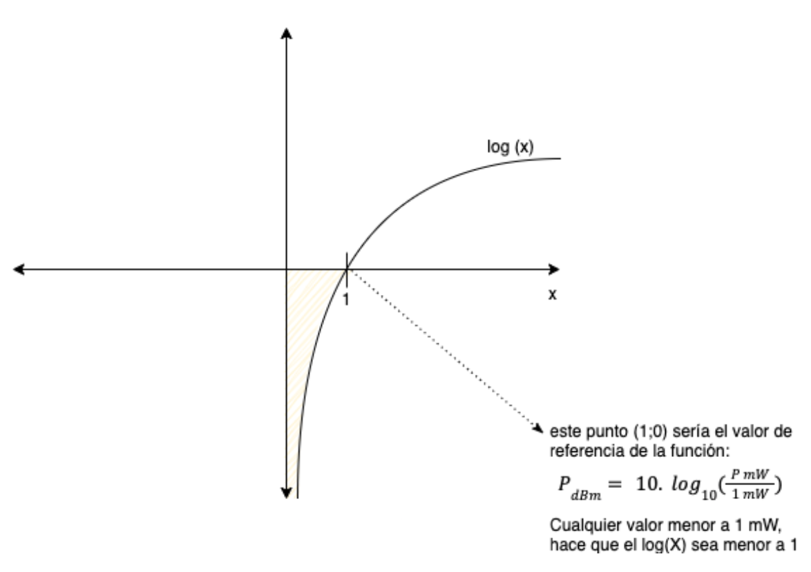
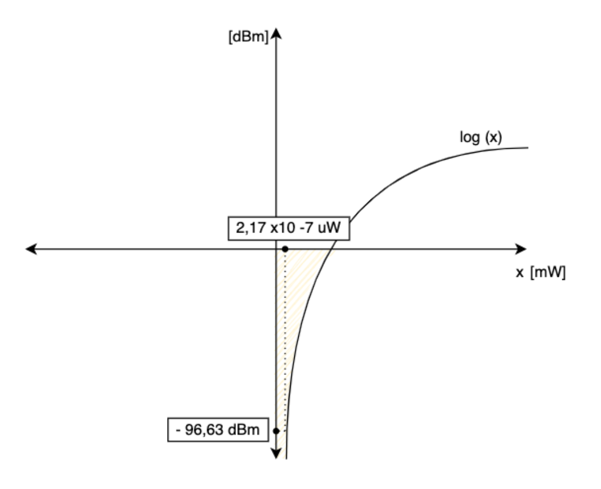

| El voltaje o la tensión entre los terminales de una antena de 300 [Ω] de un receptor de FM es de 3.5 [μVolts]                                          |
| ------------------------------------------------------------------------------------------------------------------------------------------------------ |
| a)¿Cuál será la potencia entrada en expresada en [μw] y en dBm, si la tensión de entrada es la misma y la resistencia de la antena ahora es de 57 [Ω]? |
| b) ¿Que implica que los valores obtenidos en dBm sean negativos?                                                                                       |

$ R = 57\ \Omega $

$ V = 3,5\ \mu V $

$ P = ?\mu V $ y $ ? dBm $

Pasar de $\mu V$ a $V$:

$3,5\ \mu V \rightarrow 3,5$\*$10^{-6}V$

Calculo de P:

$$
P = \frac{V^{2}}{R} = \frac{(3,5*10^{-6}V)^2}{57\ \Omega} = 2,149 * 10^{-13} W
$$

Pasar de $W$ a $\mu W$:

$2,149$\*$ 10^{-13}\ W \rightarrow 2,149$\*$10^{-7}\mu W$

$$
P_e = 2,149*10^{-7} \mu W
$$

Pasando a $P_{e[dBm]}$

$$
P_{e[dBm]} = 10 * log_{10} *(\frac{2,149* 10^{-10}\ mW}{1\ mW})
$$

$$
P_{e[dBm]} = − 96, 67 dBm
$$

> a) Las potencias de entrada calculadas son:

$ Pe = 2,149 $*$ 10^{-7} \mu W $

$ P{e[dBm]} = − 96, 67 dBm$

> b) Implica que los valores obtenidos son menores al valor de referencia. El valor de referencia es 1.

Un dBm negativo **NUNCA** indicaría una pérdida de potencia, ya que no es una medida de comparación.
El dBm (decibel referido a milivatio) es una medida de potencia.

Este gráfico también explica el ejercicio de

$$
0 dBm + 0 dBm = 1 mW + 1 mW = 2 mW = 3 dB
$$

Es decir, el gráfico muestra explícitamente porqué $ 0 dBm = 1 mW$

_El punto (1; 0) indica (1 mW;0 dBm)_

En el ejercicio 19.a, la relación queda de la siguiente manera:

