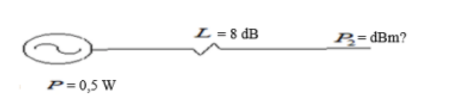

| Un transmisor tiene una señal de salida con una potencia de 0,5 W, dicha señal sufre una atenuación de 8 dB, ¿cuál será el valor de la potencia recibida en dBm? |
| ---------------------------------------------------------------------------------------------------------------------------------------------------------------- |

$$
0,5 W = 500 mW
$$

$$
n dB = 10 * log_{10}(\frac{500mW}{1 mW}) = 26,98 dBm
$$

$$
26,98 dBm - 8 dB = 18,98 dBm
$$

> El valor de la potencia recibida es de 18,98 dBm.
