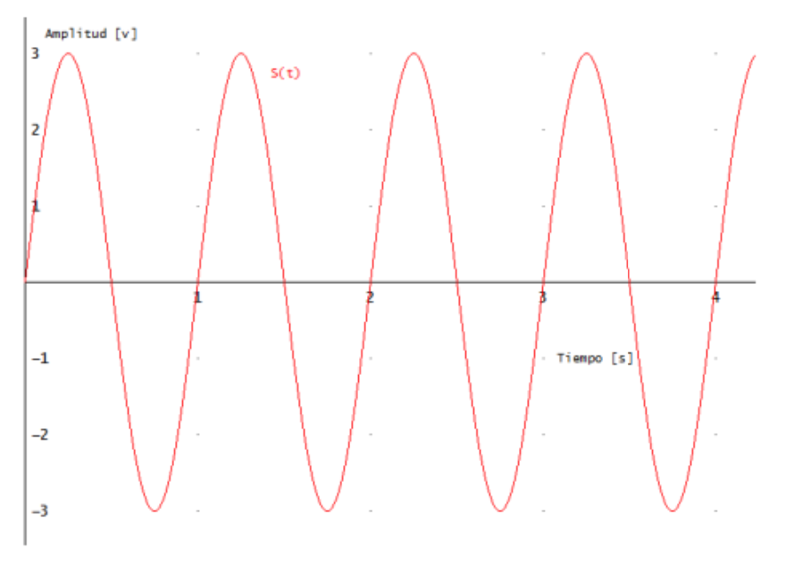

| Grafique las siguientes funciones.                                                                                |
| ----------------------------------------------------------------------------------------------------------------- |
| a) $ S{(t)} = A . sin(\omega t + \theta) $; con $ A = 3 Volt; \omega = 2\pi f_1$; $\theta = 0 $                   |
| b) $ S{(t)} = A . sin(\omega t + \theta) $; con $ A = 3 Volt; \omega = 2\pi f_2$ y $f_2 = 2 f_1$ ; $ \theta = 0 $ |
| c) $ S{(t)} = A . sin(\omega t + \theta) $; con $ A = 3 Volt; \omega = 2\pi f_2$ y $\theta = \pi / 2$             |
| d) $ f{(x)} = A . \frac{sin(x)}{x} $                                                                              |

---

a)

$$
S{(t)} = A . sin(\omega t + \theta)
$$

$ A = $ amplitud en Voltios o Amperios (también llamado valor máximo o valor pico $ 𝑉_p $ ).

$ \theta = $ ángulo inicial en radianes.

$ 𝑓 = $ frecuencia en Herzios ($Hz = Herzios$) equivale a la inversa del período $T$.

$$
S{(t)} = 3 . sin(2\pi f_1 t + 0)
$$

---

b)

$ A = 3 V $

$ \omega = 2\pi f_2 $ y $ f_2 = 2 f_1 $ entonces $ f_2 = 2 Hz $

$ \theta = 0 $

entonces:

$$
 S{(t)} = 3 * sin(2\pi f_2 t )
$$

reemplazo $ f_2 = 2 Hz $ :

$$
 S{(t)} = 3 * sin(2\pi 2 t )
$$

Para graficar necesito saber el período $ T $. Por lo que despejo $ f $:

$$
T = \frac{1}{2 Hz} = 0,5 s.
$$

Es decir, completa un ciclo en 0.5 segundos. Es decir, hace dos ciclos por segundo.

La diferencia entre el gráfico de $a$ y $b$, es la $frecuencia$. El $b$ tiene el doble de frecuencia, lo cual significa que tiene el doble de ciclos por segundo.

---

c)

$ A = 3 V $

$ \omega = 2\pi f_2 $ y $ f_2 = 4 f_1 $ entonces $ f_2 = 4 Hz $

$ \theta = \frac{\pi}{2} $

entonces:

$$
 S{(t)} = 3 * sin(2\pi f_2 t + \frac{\pi}{2} )
$$

$$
T = \frac{1}{4 Hz} = 0,25 s.
$$

Un ciclo dura 0,25 segundos. En un segundo hace 4 ciclos.

---

d)

Para dibujar la función manualmente, elegimos varios valores para x, y calculamos el valor de y.
La función es:

$$
f{(x)} = A . \frac{sin(x)}{x}
$$

Cuando $x = \frac{\pi}{2} $:

$$
f{(\frac{\pi}{2})} = \frac{sin(\frac{\pi}{2})}{\frac{\pi}{2}} = 0,66
$$

Cuando $x = \pi $:

$$
f{(\pi)} = \frac{sin(\pi)}{\pi} = 0
$$

Cuando $x = \frac{3\pi}{2} $:

$$
f{(\frac{3\pi}{2})} = \frac{sin(\frac{3\pi}{2})}{\frac{3\pi}{2}} = -0,21
$$

Cuando $x = 2\pi $:

$$
f{(2\pi)} = \frac{sin(2\pi)}{2\pi} = 0
$$

| x                | y     |
| ---------------- | ----- |
| $\frac{\pi}{2}$  | 0,66  |
| $\pi$            | 0     |
| $\frac{3\pi}{2}$ | -0,21 |
| $2\pi$           | 0     |

En $x = 0$, el cálculo $sin(0)$ es indeterminado, pero por límites laterales, vemos que se acerca a 1.

Esta función es la que representa el _espectro de potencia de señales no periódicas_.
