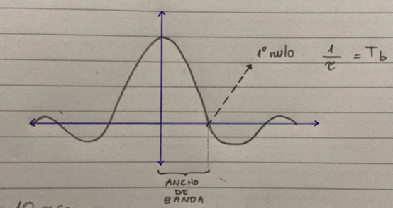

| Se transmite una señal binaria polar NRZ. Calcule el ancho de banda del 1° nulo si la duración o tiempo del bit es de: |
| ---------------------------------------------------------------------------------------------------------------------- |
| a.10 ms                                                                                                                |
| b. 0,1 $\mu s $                                                                                                        |

a)

$$
T_b = 10 ms
$$

pasar de ms a

$ 10 ms \rightarrow 0,01 s$

$$
T_b = 0,01 s
$$

$$
\tau = \frac{1}{T_b}  \quad \quad \quad \rightarrow \quad \quad \quad  \tau = 100 Hz
$$

> El ancho de banda del primer nulo es $100 Hz$

b)

$$
T_b = 0,01 \mu s = 1 * 10^{-7} s
$$

$$
\tau = 10 MHz
$$

> El ancho de banda del primer nulo es $10 MHz$
