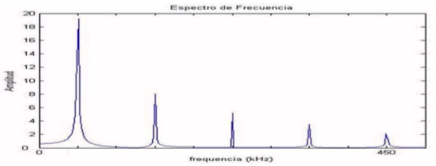
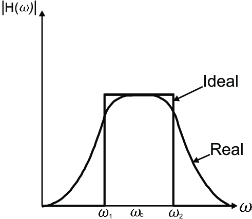

| En base al siguiente gráfico que representa el espectro de frecuencias de una señal transmitida determine:                                                                      |
| ------------------------------------------------------------------------------------------------------------------------------------------------------------------------------------------------------- |
| a. Si dicha señal puede transportar información                                                                                                                                                         |
| b. ¿Cuál es el ancho de banda, expresado en ciclos por segundo, necesario que debe tener el medio físico de transmisión para que le permita transportar todas las armónicas representadas en la figura? |
| c. ¿La señal es pasa bajo, pasa banda o eliminabanda?                                                                                                                                                   |

> a) El gráfico es discreto, es decir, muestra el espectro de frecuencias de una señal periódica. Por lo tanto, no transmite información.

b)

El ancho de banda está dado por:

$$
H = f_{max} - f_{min}
$$

El gráfico nos muestra que el noveno armónico es $f_{𝑚𝑎𝑥} = 450 kHz$

Y sabemos que las frecuencias de los armónicos son múltiplos.

Por lo tanto, si el 9o armónico es 450 kHz, podemos hacer $ \frac{450}{9} = 50 $

La frecuencia base es de 50 𝑘𝐻𝑧.

$$
f_{min} = 50 kHz
$$

$$
H = f_{max} - f_{min} = 450 kHz - 50 kHz = 400 kHz = 400 k\frac{ciclos}{segundos}
$$

> El ancho de banda necesario para transportar todas las armónicas es de $ 400 k\frac{ciclos}{segundos} $

c)

> La señal es pasabanda

Si dejamos pasar las frecuencias desde una frecuencia mínima distinta de cero hasta una frecuencia máxima hablamos de un **filtro pasabanda**.

