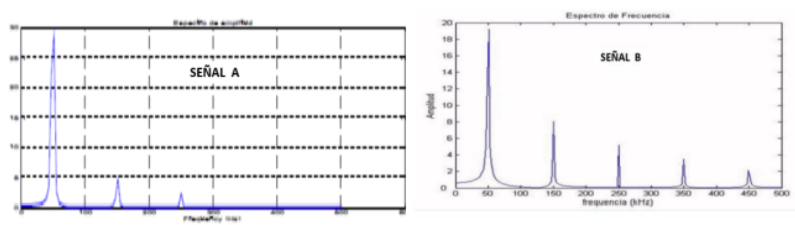

| A continuación, se muestran los espectros de frecuencia de dos señales a las cuales se les aplicaron filtros pasa bajos. Determine cuál de las dos puede transmitir información a mayor velocidad. |
| -------------------------------------------------------------------------------------------------------------------------------------------------------------------------------------------------- |
|                                                                                                                                                                            |

> Ninguna de las dos señales puede transportar información, son **señales periódicas**.
