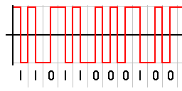

| Si se transmite con una señal Manchester, a una velocidad de transmisión de:                                                     |
| -------------------------------------------------------------------------------------------------------------------------------- |
| A. 2400bps                                                                                                                       |
| B. 56Kbps                                                                                                                        |
| C. 10Mbps                                                                                                                        |
| ¿Cuál será el tiempo de duración de un símbolo de la señal en cada caso? Exprese los valores finales en: [segundos], [ms] y [μs] |

---

La codificación **Manchester** usa la presencia o ausencia de transiciones para indicar un valor lógico

Esto aporta algunas ventajas sobre la Codificación Manchester: Detectar transiciones es a menudo menos propenso a errores que comparar con tierra en un entorno ruidoso.

Por lo que

$$
 T_b = 2 T_s
$$

a)

$$
T_b = \frac{1}{R} = \frac{1}{2400bps} = 4,16 * 10^{-4} s
$$

$$
T_s = \frac{T_b}{2} = \frac{4,16 * 10^{-4}}{2} = 2,08 * 10^{-4} s
$$

> $T_s = 2,08 $\*$10^{-4} s $

---

b)

$$
T_b = \frac{1}{R} = \frac{1}{5600bps} = 1,78 * 10^{-5} s
$$

$$
T_s = \frac{T_b}{2} = \frac{1,78 * 10^{-5}}{2} = 8,92 * 10^{-6} s
$$

> $T_s = 8,92 $\*$10^{-6} s $

---

c)

$$
T_b = \frac{1}{R} = \frac{1}{10000000bps} = 1 * 10^{-7} s
$$

$$
T_s = \frac{T_b}{2} = \frac{1 * 10^{-7}}{2} = 5 * 10^{-8} s
$$

> $T_s = 5 $\*$10^{-8} s $
