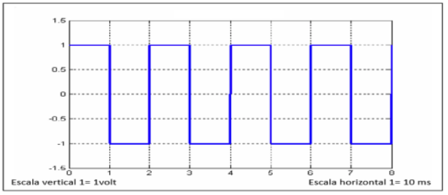
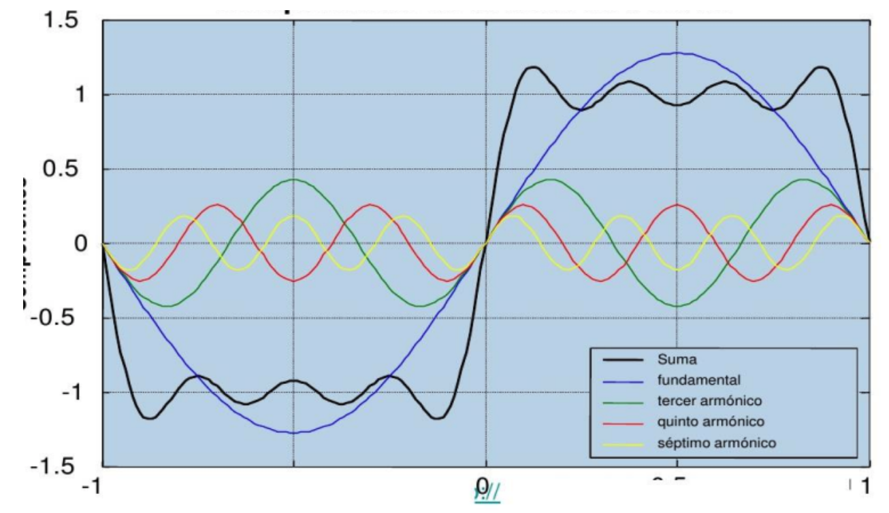

| Si la gráfica de una señal en el dominio del tiempo es la siguiente:                              |
| ----------------------------------------------------------------------------------------------------------------------- |
| a. Expresa analíticamente las 3 primeras componentes armónicas y grafique la señal resultante en el dominio del tiempo. |
| b. Grafique su espectro de frecuencia.                                                                                  |
| c. ¿Cuántas componentes armónicas necesito para obtener la misma gráfica en el dominio del tiempo?                      |

---

a)

$ T = 20 ms = 0,02 s \qquad \qquad \rightarrow \qquad T = 0,02 s $

$ f = \frac{1}{T} = \frac{1}{20ms} = 50 Hz \qquad \; \rightarrow \qquad f = 50 Hz $

La serie de Fourier para señales periódicas cuadradas:

$$
f(t) = \frac{4}{\pi} \sum_{n=1} ^{\infty} \frac{1}{2n-1} \sin ((2n-1)2\pi ft)
$$

o también (para los primeros tres armónicos):

Siendo $ \omega_0 = 2\pi f $

$$
f(t) = \frac{4}{\pi} [ \sin(\omega_0 t) + \frac{1}{3}\sin(3\omega_0 t) + \frac{1}{5}\sin(5\omega_0 t)]
$$

Solo _sobreviven_ los armónicos impares.

#### Cálculo de los primeros 3 armónicos:

- n = 1

$$
f(t) = \frac{4}{\pi} * \frac{1}{2*1 - 1} * [ \sin((2*1 - 1) * 2\pi * 50 * t) ]
$$

$$
f(t) = \frac{4}{\pi} * \frac{1}{1} * [ \sin(2\pi * 50 * t) ]
$$

$$
f(t) = 1,27 * [ \sin(2\pi * 50 * t) ]
$$

Para este armónico

$$
f = 1 * 50 = 50 Hz
$$

$$
T = \frac{1}{50 Hz} = 0,02 s
$$

- n = 2

$$
f(t) = \frac{4}{\pi} * \frac{1}{2*2 - 1} * [ \sin((2*2 - 1) * 2\pi * 50 * t) ]
$$

$$
f(t) = \frac{4}{\pi} * \frac{1}{3} * [ \sin(3* 2\pi * 50 * t) ]
$$

$$
f(t) = 0,42 * [ \sin(3* 2\pi * 50 * t) ]
$$

Para este armónico

$$
f = 3 * 50 = 150 Hz
$$

$$
T = \frac{1}{150 Hz} = 0,006 s
$$

- n = 3

$$
f(t) = \frac{4}{\pi} * \frac{1}{2*3 - 1} * [ \sin((2*3 - 1) * 2\pi * 50 * t) ]
$$

$$
f(t) = \frac{4}{\pi} * \frac{1}{5} * [ \sin(5* 2\pi * 50 * t) ]
$$

$$
f(t) = 0,25 * [ \sin(5* 2\pi * 50 * t) ]
$$

Para este armónico

$$
f = 5 * 50 = 250 Hz
$$

$$
T = \frac{1}{250 Hz} = 0,004 s
$$

Sumando los términos

$$
f(t) = 1,27 * \sin(2\pi * 50 * t) + 0,42\sin(3*2\pi * 50 * t) + 0,25\sin(5*2\pi * 50 * t)
$$

#### Gráfico de armónicos

---

c)

Para obtener la misma gráfica en el dominio del tiempo necesito **infinitas armónicas**.
