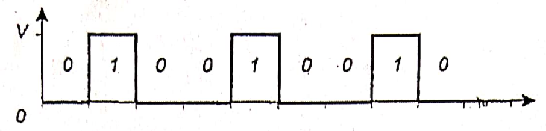

| Tomando como referencla a la figura determine la Información que aportará la aparición de un binit 0 (Cero) |
| ----------------------------------------------------------------------------------------------------------- |
|                                                                               |

$$
P(0) = \frac{6}{9} = \frac{2}{3}
$$

$$
I_0 = log_2(\frac{1}{\frac{2}{3}})
$$

$$
I_0 = 0,58\ bits
$$

> La información que aporta la aparición de un binit 0 es de $0,58\ bits$.
