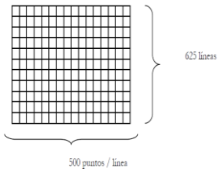

| Una imagen de televisión tiene 625 líneas con 500 puntos por línea y 128 niveles equiprobables de brillo por punto. Si se transmiten 25 imágenes por segundo, determine la velocidad de transmisión del equipo. |
| --------------------------------------------------------------------------------------------------------------------------------------------------------------------------------------------------------------- |
|                                                                                                                                                                                   |

Nos pide la velocidad de transmisión R.

$$
625\ líneas * 500\ puntos = 312500\ símbolos\ en\ imagen
$$

$$
128\ niveles\ de\ brillo\ por\ símbolo
$$

$$
I_{punto} = log_2(\frac{1}{\frac{1}{128}}) = 7 bits
$$

Cada punto transmite 7 bits de información.

Como es equiprobable, la entropía se puede calcular asi:

$$
H(imagen) = 312500\ \frac{símbolos}{imagen} * 7 \frac{bits}{símbolos}
$$

La entropía de una imagen:

$$
H(imagen) = 2187500\ \frac{bits}{imagen}
$$

Y siendo

$$
R = H(S) * r
$$

$$
R = 2187500\ \frac{bits}{imagen} * 25 \frac{imagenes}{segundo}
$$

$$
R = 54687500\ \frac{bits}{segundo}
$$

$$
R = 54,68\ M\frac{bits}{segundo}
$$

> La velocidad de tranmición es de $ 54,68\ Mbps $
