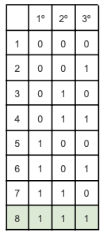

| Calcular la probabilidad que aparezcan 3 caras consecutivas en la tirada de una moneda y su información asociada. |
| ----------------------------------------------------------------------------------------------------------------- |

3 caras consecutivas

- 0 = seca
- 1 = cara

8 eventos equiprobables $ \rightarrow P(3\ caras) = \frac{1}{8} $

$$
I_{3\ caras} = log_2(\frac{1}{\frac{1}{8}}) = 3 bits
$$

> La probabilidad de que caiga 3 caras consecutivas es de $ \frac{1}{8} $ y la información asociada de $ 3\ bits $
