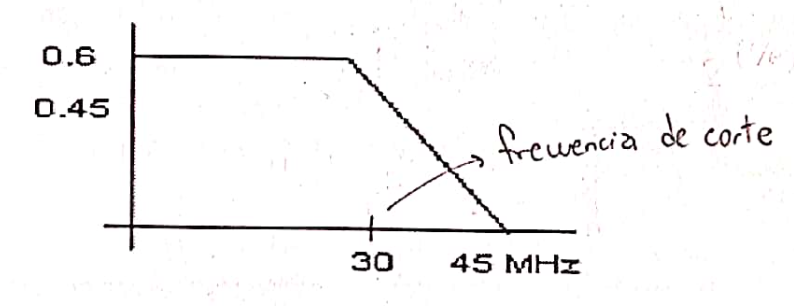
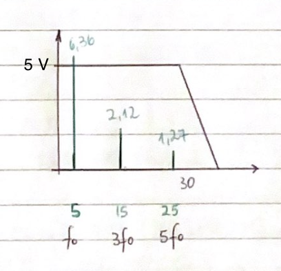

| Un par trenzado se comporta aproximadamente como un filtro con las características de la siguiente figura.                                                                                                                                                                                                                                                 |
| ---------------------------------------------------------------------------------------------------------------------------------------------------------------------------------------------------------------------------------------------------------------------------------------------------------------------------------------------------------- |
|                                                                                                                                                                                                                                                                                                                                |
| Dicha figura muestra la cantidad de atenuación de la señal en función de la frecuencia. Supongamos que enviamos una señal cuadrada compuesta de una sucesión de unos y ceros alternados, donde el uno se codifica con un valor de [5 volts] y el cero con un valor de [-5 Volts]. El tiempo de duración del cero =tiempo de duración del uno = 0.1 (useg). |
| a) Obtenga el espectro en frecuencia de la señal a la salida del cable aplicando Fourier (fórmula). Justifique su respuesta.                                                                                                                                                                                                                               |
| b) Obtenga el espectro en frecuencia de al señal a la salida del cable aplicando Fourier (gráfico)                                                                                                                                                                                                                                                         |

- Serie de Fourier para una señal cuadrada

$$
S(t) = \frac{4*V_p}{\pi} \sum_{n=1}^{\infty} \frac{1}{n} \sin\left( \omega_0 t \right)
$$

- $ \omega_0 = 2\pi f_0 $

- El valor pico ($ V_p $) es de 5 Voltios.

$$
V_p = 5 V
$$

- No tenemos la frecuencia, pero si tenemos el tiempo de duración de un símbolo. A partir de este dato podemos calcular $ T $ y $ f $.

$$
T_s = 0,1 \mu s = 0,1 * 10^{6} s
$$

$$
T = 2 *T_b = 2 * 0,1 * 10^{6} s = 2 * 10^{-7} s
$$

$$
T = 2 * 10^{-7} s
$$

$$
f = \frac{1}{T} = 5\space MHz
$$

- Reemplazando valores en la Serie de Fourier

$$
S(t) = \frac{4*V_p}{\pi} * [ sin(\omega_0 T) + \frac{1}{3} * sin(\omega_0 T) + \frac{1}{5} * sin(\omega_0 T) + \frac{1}{7} * sin(\omega_0 T) ]
$$

- Cálculo de cada armónico:

$$
f_1 = \frac{4*5}{\pi} * sin(2\pi * 5\space MHz * t) = 6,36 * sin(2\pi * 5\space MHz * t)
$$

$$
f_3 = \frac{4*5}{\pi} * \frac{1}{3} * sin(2\pi * 15\space MHz * t) = 2,12 * sin(2\pi * 15\space MHz * t)
$$

$$
f_5 = \frac{4*5}{\pi} * \frac{1}{5} * sin(2\pi * 25\space MHz * t) = 1,27 * sin(2\pi * 25\space MHz * t)
$$

$$
f_7 = \frac{4*5}{\pi} * \frac{1}{7}  * sin(2\pi * 35\space MHz * t) = 0,9 * sin(2\pi * 35\space MHz * t)
$$

- Para el séptmino armónico la frecuencia da 35 MHz, lo que excede el filtro del ejercicio. (el filtro mata el armónico)

> a) Espectro en frecuencia de la señal a la salida del cable

$$
S(t) = 6,36 * sin(2\pi * 5\space MHz * t) + 2,12 * sin(2\pi * 15\space MHz * t) + 1,27 * sin(2\pi * 25\space MHz * t)
$$

> b)

