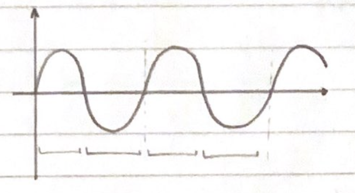

| ¿Cuántos baudios tiene un tono senoidal de 1000 Hz? ¿Cuántos bits de información lleva? |
| --------------------------------------------------------------------------------------- |

1000 Hz $ \rightarrow $ 1000 ciclos en 1 segundo

$ \rightarrow $ Cada ciclo tiene 2 símbolos

$ \rightarrow $ Entonces en 1 segundo hay 2000 símbolos

Usando fórmulas,

$$
r = 2*B
$$

$$
r = 2*1000\space Hz
$$

$$
r = 2000\space baudios
$$

> a) Un tono senoidal de 1000 Hz tiene 2000 baudios.

> b) No lleva información porque es periódoca.
